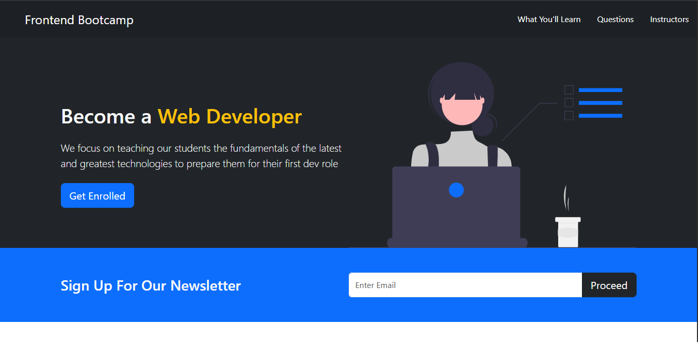
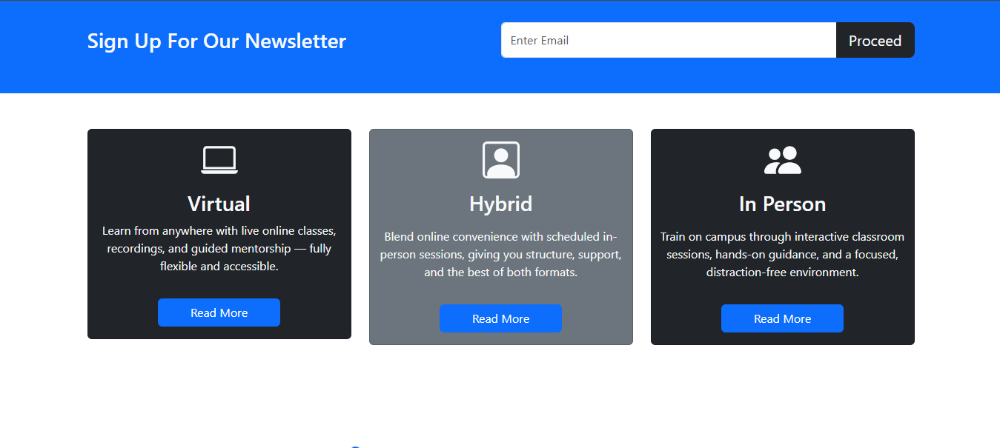
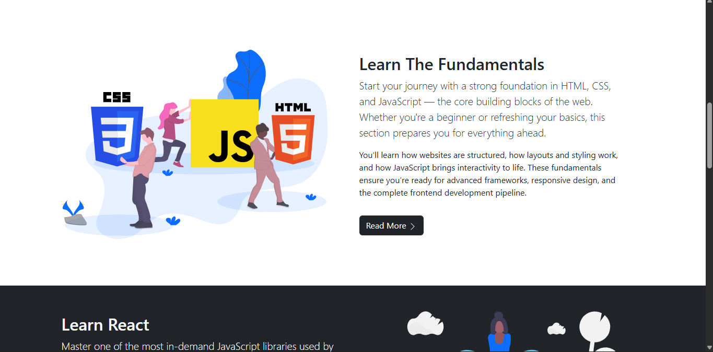
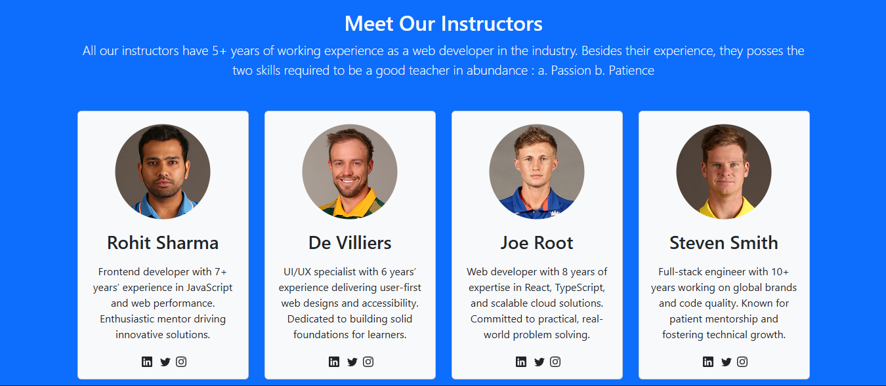
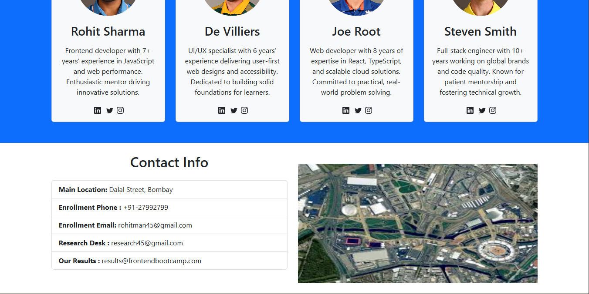

# Frontend Bootcamp Website

A modern and responsive landing page for a Frontend Development Bootcamp, built using the **Bootstrap 5 framework**. The website showcases course modules, learning formats, and FAQs in a clean and professional layout.

---

## 🚀 Features

- Fully responsive design using Bootstrap
- Hero section with call-to-action
- “Learn The Fundamentals” and “Learn React” modules
- Learning modes: Virtual, Hybrid, In Person
- FAQ accordion section
- Clean UI with modern typography
- Integrated illustrations for each section

---

## 🛠️ Tech Stack

- HTML5
- CSS3
- Bootstrap 5

---

## 📁 Folder Structure

```
Frontend Bootcamp/
├── index.html
├── style.css
├── Preview
└── README.md
```

## 📸 Preview







