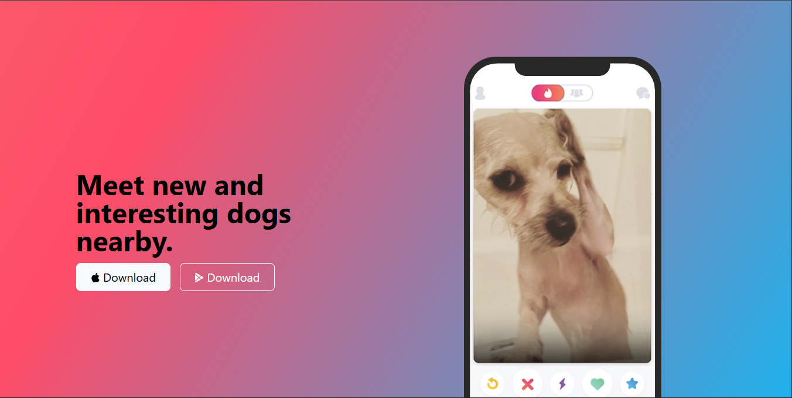
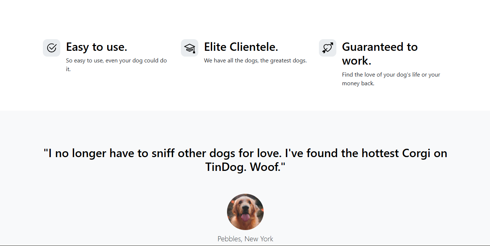
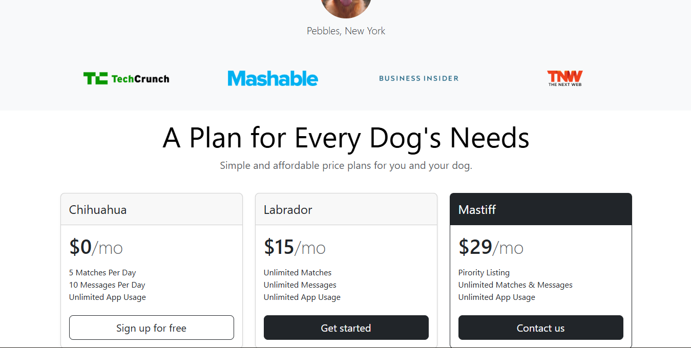
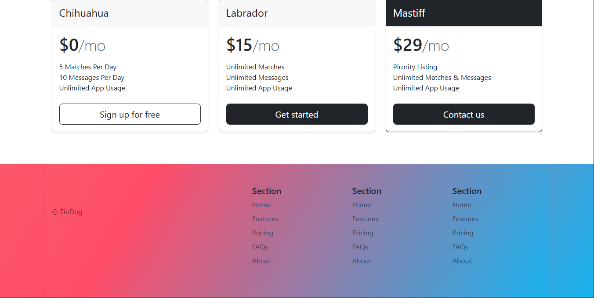

# 🐶 TinDog

A fun, responsive landing page built using **HTML**, **Bootstrap**, and minimal **CSS**. TinDog is a fictional startup inspired by Tinder — but for dogs! Swipe, match, and play… dog-style 🐾

---

## ✨ Features

📱 Fully responsive layout built with Bootstrap

🐾 Clean and modern UI

🚀 Animations and smooth scrolling

🐶 Showcases brand features and call-to-action sections

⭐ Testimonials and pricing cards

🎨 Custom CSS enhancements

## ⚙️ Built With

- **HTML5** — for semantic structure and accessibility
- **Bootstrap** - for adding the core design and styling the entire page. Bootstrap provides reusable components that can be used to shorten developement time while not sacrificing the final output of the project.
- **CSS3** — for customizing and adding personalized changes to the bootstrap version of the website.

## 📁Folder Structure

```TinDog/
├── assets/
│   ├── screenshot.png
│   └── (preview images)
│── styles.css
├── index.html
└── README.md
```

## 📸 Preview






## 🙌 Acknowledgements

- Bootstrap 5 for the responsive framework
- Bootstrap Icons
- Original idea inspired by Angela Yu’s TinDog project
