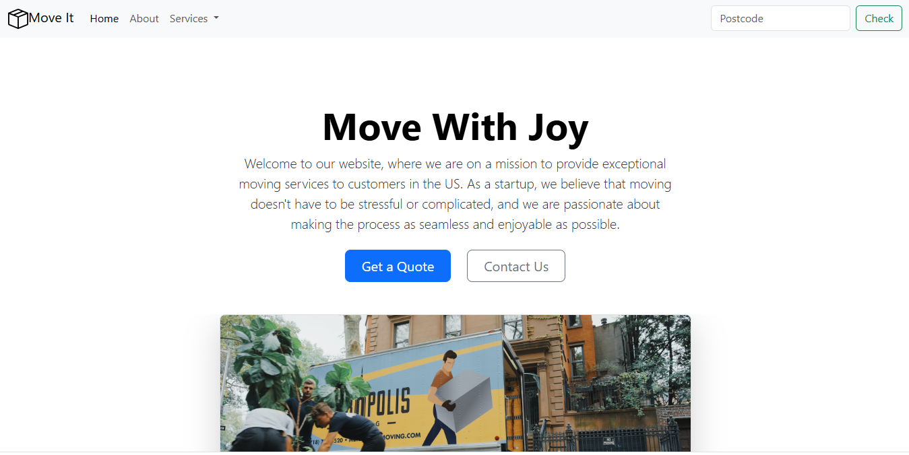
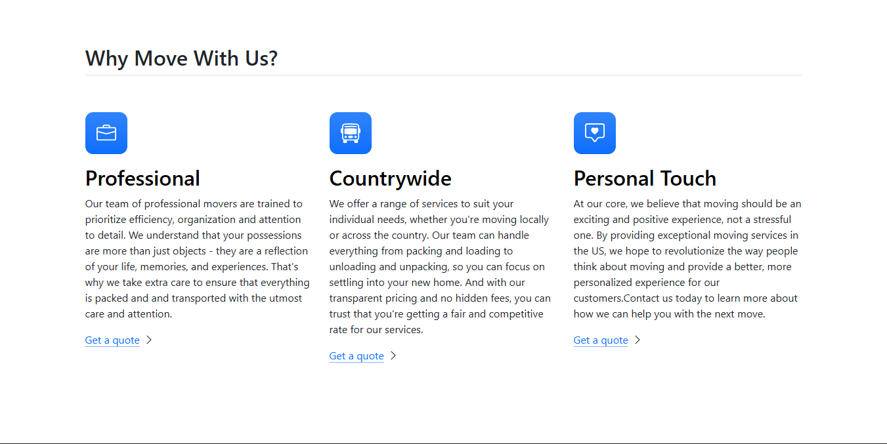
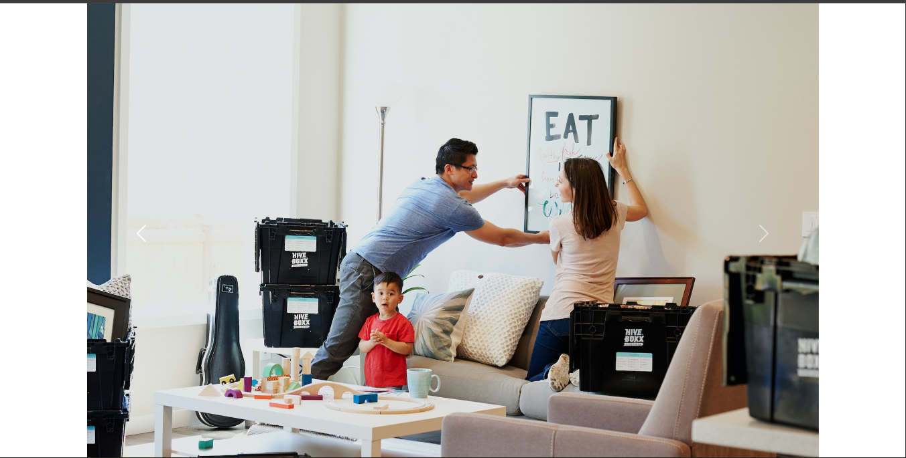

# 📦We Move It

A responsive, modern landing page for a **Packers & Movers service**, built entirely with **HTML** and **Bootstrap**.  
The website includes a hero section, service highlights, a testimonial carousel, pricing/service packages, and a strong call-to-action for customer leads.

---

## ⚙️ Built With

- **HTML5** — for semantic structure and accessibility
- **Bootstrap** - for adding the core design and styling the entire page. Bootstrap provides reusable components that can be used to shorten developement time while not sacrificing the final output of the project. The carousels have also been implemented using Bootstrap 5.

## ✨ Features

- 🏠 Modern Landing Page Layout
- 📱 Fully Responsive Design
- 🎞️ Bootstrap Carousel Integration
- 🧰 Service Highlights Section
- 💡 Why Choose Us Section
- 🎨 Bootstrap Utility-Based Styling

## 📁Folder Structure

```WeMoveIt/
├── Images/
│   ├── screenshot.png
│   └── (preview images)
│── styles.css
├── index.html
└── README.md
```

## 📸 Preview






## 🙌 Acknowledgements

- Bootstrap 5 for the responsive framework
- Bootstrap Icons
- Original idea inspired by Angela Yu’s WeMoveIt project
